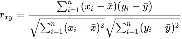

# QQ BROWSER 2021 AI ALGORITHM COMPETITION - 民谣跟摇滚去蹦迪啦 Solutions
## Team
仉鹏， 浙江大学
郑凌瀚， 蚂蚁集团 
严瑞卿， 北京石油化工学院

## Overview
本问题想寻找好的视频表征方法，以在视频去除、内容检索领域提高向量表征的质量。本方法的基本思路非常简单，通过不同的**pretext task获取视频各个模态的表征（不同领域的知识）**，然后建立**knowledge-fusion**模块使用pair-relation去进一步增强视频表征的效果。本方案的pipeline如下：

具体来讲，本方案尝试了multi-tag prediction、 video-text matching、contrastive learning等不同类型的pretext task（或者组合task），来学习不同类型的表征（知识）， 然后讲这些表征进行存储，存储之后使用pair-relation来学习一个task-specific的映射（即一个有利用本问题任务的求解的fusion模块）。

我们没有使用end2end的finetune模式，主要原因是：

1. 我们认为同一个模型很难很好学习不同的知识，不同的task之间往往是相互限制（一些multi-task的文章指出，不同的task之间存在negetive transfer[1]）

2. 我们fusion使用的loss对batch-size比较敏感，大的batch-size性能明显好于batch-size，而end2end的training会极大的限制batch-size 

3. end2end training 是可以整合不同的pretext embedding的，但是优化起来比较困难。

本方案的优势如下：
1. 将问题形式化为**表征学习-知识融合**的two-stage的模式，可以实现pretext task即插即用
2. 本方案提出了一种Large-Batch-Pearson’s coefficient Loss(LBPC Loss)， 拟合pair-relation的性能明显好于Mean Squared Error loss(MSE Loss), 在线下验证上好于MSELoss 2%
## Model

### transformer

采用同一个bert-chinese-base模型处理title asr 文本取max_len=32，对frames输入先做一次线性变化到768维度，采用12层transformer模型处理frames，然后再进行一次线性变换到768维度与文本变换到同一个语境

然后将title asr的lastlayer输出与frames的输出在序列维度上拼接，总计96,再过一个12层transformer结构，学习多模态交互信息，之后取title,asr的cls位以及frames的32位的mean pooling进fusion结构

拟合10000维的多变迁分类并使用对比学习loss加权  验证集相似度达到0.695

输出10000维多标签分类的logit,fusion层输出logit，title的cls位embedding,asr的cls位embedding，frames的mean pooling embedding给下游任务做finetune
### baseline 

采用同一个bert-chinese-base模型处理title文本取max_len=32，对frames输入nextvlad，再通过fusion层学习多模态交互信息

拟合10000维的多变迁分类  验证集相似度达到0.67

输出10000维多标签分类的logit,fusion层输出logit给下游任务做finetune
### 5video

采用同一个roberta-wwm-chinese-large模型处理title 文本取max_len=32，对frames 采用nextvlad netvlad netrvlad softdbow netfv进行特征提取

进入fusion层学习多模态交互信息

拟合10000维的多变迁分类  验证集相似度达到0.709

输出10000维多标签分类的logit,fusion层输出logit，title的cls位embedding,asr的cls位embedding，frames的mean pooling embedding给下游任务做finetune

## Pretrain


### multi tagging
即baseline的 multi tagging task
### video-text matching
参考UniVL[2], 学习一个将video与text对其的知识。loss形式如下（tensorflow）
```python
def simcse_loss(h1, h2, temp=0.1):
    """用于SimCSE训练的loss
    """
    # 构造标签
    idxs = K.arange(0, K.shape(y)[0])
    idxs_1 = idxs[None, :]
    idxs_2 = idxs[:, None]
    y_true = K.equal(idxs_1, idxs_2)
    y_true = K.cast(y_true, K.floatx())
    # 计算相似度
    h1 = K.l2_normalize(h1, axis=1)
    h2 = K.l2_normalize(h2, axis=1)
    
    similarities = K.dot(h1, K.transpose(h2)) / temp
    loss = K.categorical_crossentropy(y_true, similarities, from_logits=True)
    return K.mean(loss)
simcse_loss(bert_embedding1, vision_embedding1,  temp=0.1)
```
### contrastive learning
进来对比学习在自监督学习领域大火（图像领域SimCLR、moco等、文本领域SimCSE等），我们尝试引入了NCE(Noise Contrastive Estimation)对video数据进行对比学习，以期获得不一样的的表征，实验证明加入该任务之后，模型会迅速收敛，且性能有所提升。loss形式同video-text matching的loss。
```python
simcse_loss(vision_embedding1, vision_embedding2,  temp=0.1)
```

## Fusion

### Large-Batch-Pearson’s coefficient Loss(LBPC Loss)
为了将各种pretext task学习到的知识进行融合，以期得到利于目标任务的表征，我们对评价指标进行了分析。Spearmanr‘s rank Correlation这个指标是没法直接优化的，我们首先考虑了`Pearson correlation coefficient`,如下式所示：

其中$x$是我们预测的余弦相似度，$y$是groudtruth。不难发现，上式是可以直接被优化的，但是实践表明，上式优化并不容易（效果不好），我们尝试对$x$进行平滑，经过一个$softmax$函数, 结果便非常稳定。效果比MSE Loss稳定好2%。`Pytorch`的代码如下：
```python
class SpearmanCorrelationLoss(nn.Module):
    def __init__(self, temp=0.2):
        super(SpearmanCorrelationLoss, self).__init__() 
        self.temp = temp
    def forward(self, input1, input2, label, return_sim=False):
        similarity = cosine(input1, input2)
        similarity_sm = F.softmax(similarity / self.temp, dim=0)
        similarity_sm = similarity_sm -  torch.mean(similarity_sm)
        label = label - torch.mean(label)
        t_m1 = torch.sqrt(torch.sum(similarity_sm ** 2))
        t_m2 = torch.sqrt(torch.sum(label ** 2))
        correlation = torch.sum(similarity_sm*label) / (t_m1 * t_m2 + 0.00001)
        if return_sim:
            return -correlation, similarity
        else:
            return -correlation   
```
注：temp（temperature）为可调节的超参，实验表征0.2效果最佳，且鲁棒性很强（0.1-2之间，变化不超过2%）
### SE-Fusion
用于融合的模型非常简单，基本思路是各个embedding（各种不同的知识）分别经过一个MLP（或者text-CNN）映射，然后concat在一起，经过SENet进行融合。
需要解释的是为了弥补two-stage模型拟合能力的缺失（不可否认，相较于end2end finetune的范式，存储embedding的方式确实存在模型拟合能力不够强的弱势），我们采取了以下几个措施来缓解：
1. 将pretrain model中的frame的表征、text的表征、fusion的表征，以及tag-prediction的logit分别进行存储。
2. 将bert（roberta）的last layer的embedding分别进行存储，用学习一个text-CNN进行映射。
## code

```shell
../submix
    |--zlh
        |--transformer模型
    |--yrq
        |--5videos模型
    |--zp
        |-- baseline模型
    |--fusion
        |-- ...
    |--embedding
        |-- 预训练的模型对验证集，测试集的推理结果
    |--img
        |-- 图片
    |--README.md 说明文件

```
1. `yrq`、`zp`、`zlh`三个文件下，是pretrain（pretext task）的代码，每个人的运行环境略有不同，每个pretext task训练完成后，会生成各自的embedding放在embedding文件里。每个文件下有运行的说明
2. `fusion`文件下融合的代码，运行方式见该文件夹下的`readme.md`，复现线上效果可直接运行。目前embedding还在上传。

## reference

[1] Modeling Task Relationships in Multi-task Learning with Multi-gate Mixture-of-Experts KDD '18

[2] UniVL: A Unified Video and Language Pre-Training Model for Multimodal Understanding and 
[3] A Simple Framework for Contrastive Learning of Visual Representations
[4] Big Self-Supervised Models are Strong Semi-Supervised Learners
[5] Momentum Contrast for Unsupervised Visual Representation Learning
[6] SimCSE Simple Contrastive Learning of Sentence Embeddings

