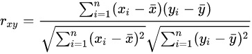

# CIKM2021CUP- **多模态视频相似度**

首先感谢两位队友的努力，@zlh1992，@yrqUni

1. 赛题介绍、数据集下载见[here](https://algo.browser.qq.com/), 另外我制作了一个[PPT](cikm2021-multimodulity-retrieval.pdf)来介绍赛题。

2. 该比赛第一名的方法[论文](https://arxiv.org/abs/2111.01677)及[代码](https://github.com/zr2021/2021_QQ_AIAC_Tack1_1st)已开源。
3. 我参赛的方案，在[my_solution.md](my_solution.md)中描述
4. 在TOP1方法的基础，我将一个自己方案中的loss进行实验，发现可以改进baseline的方法。下面详细介绍

## Large-Batch-Pearson’s coefficient Loss(LBPC Loss)

### MSE

Spearmanr‘s rank Correlation这个指标是没法直接优化的，现有开源的比赛方法中，得到一对视频embedding后，算出cosine similarity然后使用MSE loss去拟合groudtruth。但是这样的做法对没有直接对`Spearmanr‘s rank Correlation`进行优化，得到的结果必然也是次优的。

### Rank normalization of targets（RNT）

这是top1的处理方法，首先将target进行排序然后，将顺序normalize得到新的target，然后使用MSE拟合新的target。[文中](https://arxiv.org/abs/2111.01677)指出，可以比直接拟合MSE高0.006.

但是，实际上由于target由生成过程的特点，不难发现，实际上target只有20中不同的取值，这使得normalize之前相同的target，在normalize后会不一样。这样的变换让模型去学习，会导致模型的疑惑，也没有直接的对相关性进行建模，模型很难学习listwise的知识。

### our method

为了解决上述两类方法存在的问题，我在拟合target上提出了一个**Large-Batch-Pearson’s coefficient Loss**(LBPC)，来直接逼近Spearmanr‘s rank Correlation这个指标。

首先考虑`Pearson correlation coefficient`,如下式所示：



其中$x$是成对embedding算出的余弦相似度，$y$是groudtruth。不难发现，上式是可以直接被优化的，但是实践表明，上式优化并不容易（效果不好），我们尝试对$x$进行平滑，经过一个$softmax$函数, 结果便非常稳定。效果比MSE Loss稳定好2%。`Pytorch`的代码如下：

```python
class SpearmanCorrelationLoss(nn.Module):
​    def __init__(self, temp=0.2):
​        super(SpearmanCorrelationLoss, self).__init__() 
​        self.temp = temp
​    def forward(self, input1, input2, label, return_sim=False):
​        similarity = cosine(input1, input2)
​        similarity_sm = F.softmax(similarity / self.temp, dim=0)
​        similarity_sm = similarity_sm -  torch.mean(similarity_sm)
​        label = label - torch.mean(label)
​        t_m1 = torch.sqrt(torch.sum(similarity_sm ** 2))
​        t_m2 = torch.sqrt(torch.sum(label ** 2))
​        correlation = torch.sum(similarity_sm*label) / (t_m1 * t_m2 + 0.00001)
​        if return_sim:
​            return -correlation, similarity
​        else:
​            return -correlation   
```
在我的实验室里，使用该loss在我的solution里面，由于不需要end2end的finetune，所以batchsize可以设置为2048，效果要比直接用MSE拟合label好0.01.

进一步的，在top1代码的基础上进行实验。只需要修改其[`finetune.py`](https://github.com/zr2021/2021_QQ_AIAC_Tack1_1st/blob/25c4e56dd0e1023763ddf54743eb5cbe97a69862/job1/finetune.py#L72)
```python
#loss = nn.MSELoss()(cos_sim.view(-1), target.view(-1))  ===>
loss = SpearmanCorrelationLoss(0.2)(emb1, emb2, target.view(-1))
```
由于top1的预训练过程对机器要求比较苛刻(单模在 1 张 a100 上大约需要 pretrain(2 day)，finetune(2 hour))，我的实验在作者提供的预训练权重上进行（这里非常感谢作者）。实验结果如下：

| exp        | Valid Spearman | online|
| ---------- | -------------- | ------|
| RNT+MSE    | 0.884          | 0.833 |
| LBPC(ours) | 0.885          | 0.836 |
| RNT+LBPC   | 0.8865         | 0.834 |

其中，RNT是Rank normalization of targets的缩写。

 在比赛时发现，loss中的温度超参是一个影响较大的超参，受限于机器条件，我无法进行必要的调参，只是将作者使用的MSE Loss 换成LBPC，，但是也可以看到明显的提高（0.002在比赛当时，最多可以拉开6个名次）。


